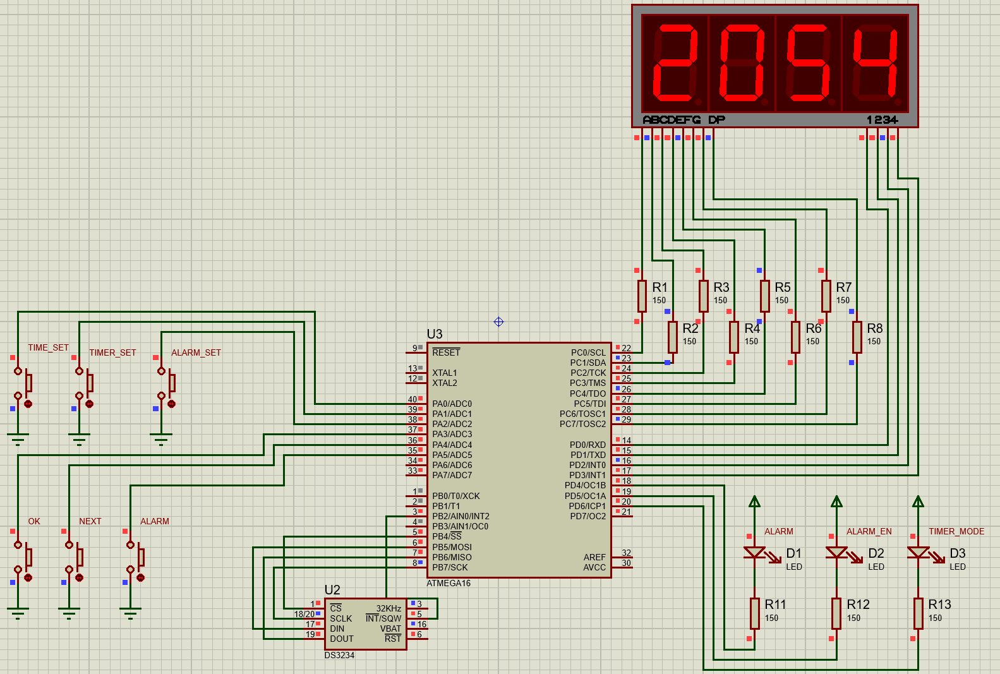

Для задания:

Собрать схему часов и разработать программу, используя семи сегментный индикатор типа 7SEG-BCD и дополнительные светодиоды при необходимости, для отсчета времени использовать внешнюю микросхему RTC DS3231 или аналогичную. Реализовать функцию будильника, реализовать функцию таймера. Переключение осуществлять при помощи кнопок

