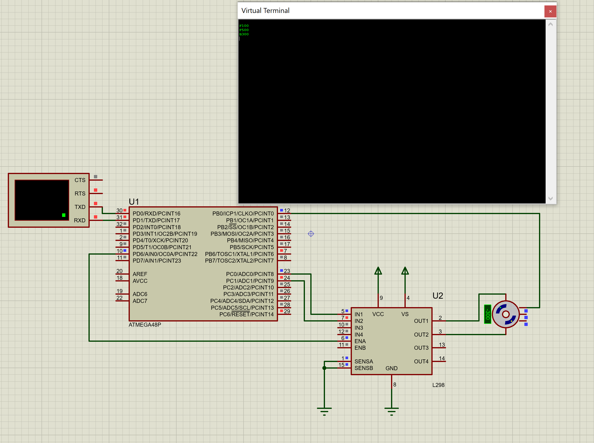

Для задания:
Реализовать схему управления коллекторным электродвигателем, предусмотреть смену полярности и управления скоростью вращения при помощи ШИМ. Регулировать обороты двигателя по сигналу от оптического энкодера. Обороты двигателя и его направление вращения задаются командой через терминал.

